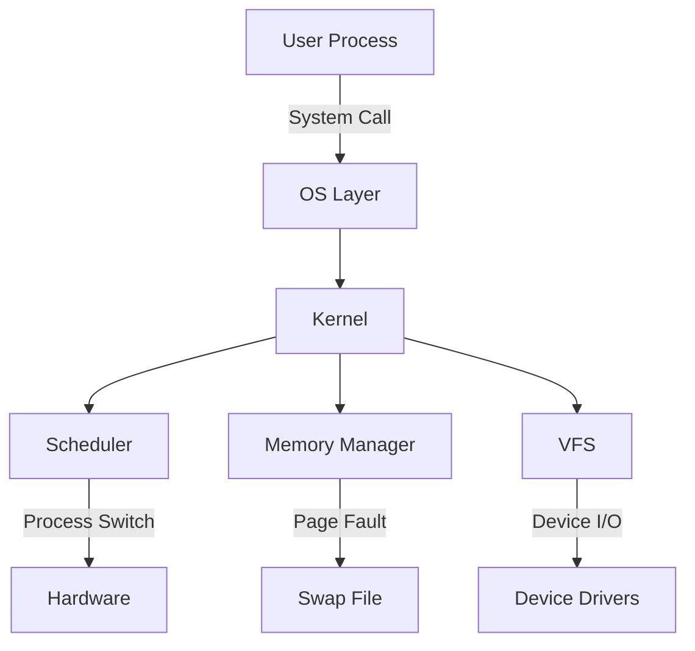

# Java Operating System Emulation


## Overview
This project presents a functional Operating System simulation, providing insight into important OS concepts/mechanisms. It creates a virtual environment for concurrent process execution, resource competition, and communication via system interfaces.

The simulation implements realistic OS behaviors: preemptive multitasking, virtual memory with demand paging, priority-based scheduling, and a layered architecture. It serves as an educational tool, demonstrating system-level concepts and allowing experimentation with OS algorithms in a controlled, visible environment.

Key aspects include realistic timing, user/kernel space abstraction, and robust system call interfaces, all within an extensible codebase.

### Value
This project demonstrates:
- **Operating System Design Principles**
- **Memory Management Strategies**
- **Process Scheduling Algorithms**
- **System Call Implementation**
- **Virtual Memory Systems**
- **Inter-Process Communication**

## Key Features

### Core Systems
- **Process Management** - Create, manage, and terminate multiple user-level processes
- **Priority-Based Scheduling** - Multi-level scheduling with Real-time, Interactive, and Background priorities
- **Virtual Memory System** - Complete paging implementation with TLB and swap file support
- **Dynamic Memory Allocation** - System calls for memory allocation and deallocation
- **Inter-Process Communication** - Message-passing system via `KernelMessage` objects

### Memory Management
- **Translation Lookaside Buffer (TLB)** - Hardware-simulated memory translation caching
- **Page Fault Handling** - Automatic swapping between physical memory and disk
- **Virtual Address Space** - Process isolation through virtual memory abstraction

### System Components
- **Virtual File System (VFS)** - Unified interface for different device types
- **Device Abstraction Layer** - Pluggable device architecture
- **Hardware Emulation** - Simulated physical memory and hardware components

## Core Components

| Component | Description |
|-----------|-------------|
| **`Kernel.java`** | Central OS kernel handling system calls and resource management |
| **`OS.java`** | Public API layer for user processes to interact with the kernel |
| **`Hardware.java`** | Hardware simulation including physical memory and TLB |
| **`Scheduler.java`** | Multi-level priority scheduler with quantum-based preemption |
| **`PCB.java`** | Process Control Block storing process state and metadata |
| **`VFS.java`** | Virtual File System providing unified device access |
| **`UserlandProcess.java`** | Base class for user-space processes |

## Getting Started

### Prerequisites

- **Java Development Kit (JDK) 8+**
- **Command line interface** (Terminal/Command Prompt)

### Installation & Setup

1. **Clone the repository**
   ```bash
   git clone <repository-url>
   cd java-os-emulation
   ```

2. **Compile the source code**
   ```bash
   javac src/*.java
   ```

3. **Run the simulation**
   ```bash
   java -cp src Main
   ```

## Testing & Examples

The simulation includes comprehensive test suites and example processes:

### Memory Management Tests
- **`MemoryReadWriteTest`** - Basic allocation and access patterns
- **`MemoryExtensionTest`** - Multiple memory block allocation
- **`AccessViolationTest`** - Segmentation fault handling
- **`PiggyProcess`** - Memory-intensive process triggering paging/swapping

### Inter-Process Communication
- **`HelloWorld` / `GoodbyeWorld`** - Basic message passing demonstration
- **`Ping` / `Pong`** - Bidirectional communication example

### System Integration
- **`Tests.java`** - Multi-priority scheduling and process lifecycle
- **`Tests_A3.java`** - VFS functionality with `RandomDevice` and `FakeFileSystem`

## System Operation Flow




